# 概率机器人算法整理

写一点自己对于算法的理解来帮助记忆和运用

数学推导和证明详见书本

- 由于难度原因，找了一个讲的还算不错的网课，[油管地址](https://www.youtube.com/watch?v=U6vr3iNrwRA&list=PLgnQpQtFTOGQrZ4O5QzbIHgl3b1JHimN_)

## Bayes Filter

- 建立在**隐马尔可夫链**的模型上

x为状态，u为控制，z为观测结果

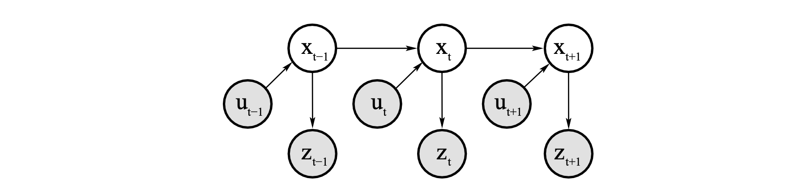

算法的一次迭代分为两步

- 控制更新

  也就是通过$u_t$的控制把状态由$x_t$转化为$x_{t+1}$，之后更新**预测置信分布**$\bar{bel(x)}$

- 测量更新

​		通过新状态x下观测到的值z来更新置信度分布$bel(x)$	

算法的图示

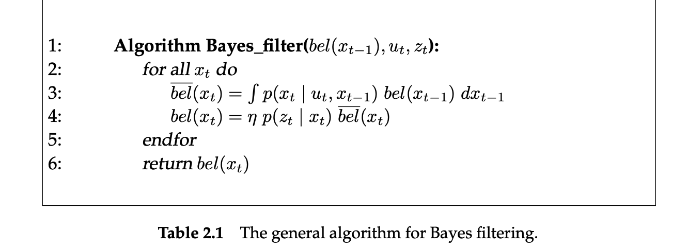

## Kalman Filter

本质上和bayes filter干的是同一件事情，只不过多了**多元正态分布**和**线性状态转移**这两个限制因子，导致出现了非常好的数学性质

- 一个线性移动机器人的例子

https://zhuanlan.zhihu.com/p/39912633

- 线性状态转移带来的结果(u步)：

原预测+已知的外部影响+未知的外部影响，也是书上写的$x_t=A_tx_{t-1}+B_tu_t+\epsilon_t$

- 由测量结果带来新的预测(z步)

规定一些符号：测量值矩阵为$H_k$,测量误差的协方差矩阵为$R_k$,读数的均值向量为$z_k$
$$
\mu_t=H_tx_{expected}\\
\Sigma_t=H_t\Sigma_{expected}H_t^T
$$
为什么是准的?

由于高斯分布是单峰的，所以直接把两个分布各自的均值和协方差做内积，即可获得在噪声条件下的最优估计（图例见链接）

- 卡尔曼增益

由多元正态分布推导出来的良好状态转移性质
$$
K = \Sigma_0(\Sigma_0+\Sigma_1)^{-1}\\
\hat\mu = \mu_0+K(\mu_1-\mu_0)\\
\hat\Sigma=\Sigma_0-K\Sigma_0
$$

- 算法

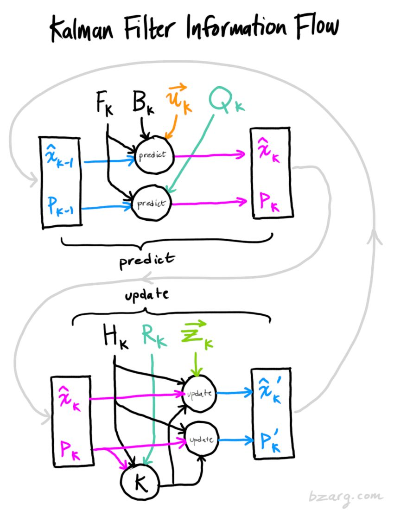

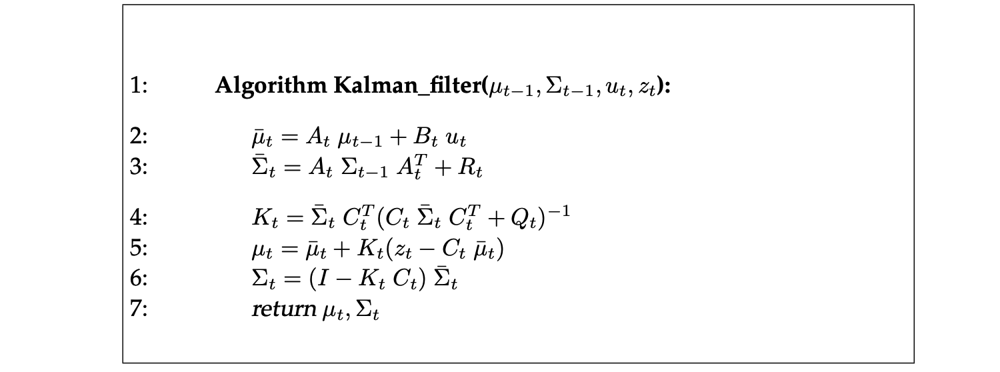

### Extended Kalman Filter

对于非线性映射g，变换之后的状态并不符合正态分布

扩展卡尔曼滤波的思想就是通过泰勒展开的一阶形式来达到类似于线性变换的结果

个人的理解是这个方法的基本思想是来源于概率论当中的**变量变换定理**
$$
p(u,v)=p(x(u,v),y(u,v))|\mathbf{J}|
$$
结果就是在h变换的一阶泰勒展开形式下，h函数可以如下线性化
$$
h(x_t):=h(\bar{\mu_t})+\frac{\partial h(x_t)}{\partial x_t}(x_t-\bar{\mu_t})
$$
由此可以得到如下的扩展卡尔曼滤波算法

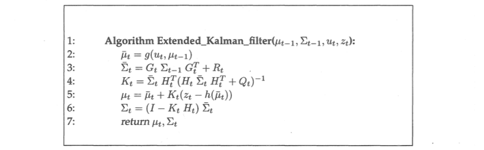

### Unscented Kalman Filter

除了泰勒展开的另一种近似

通过加权统计线性回归来实现随机线性化（没学过线性回归，所以只能理解为一种拿了更好参数的线性近似）

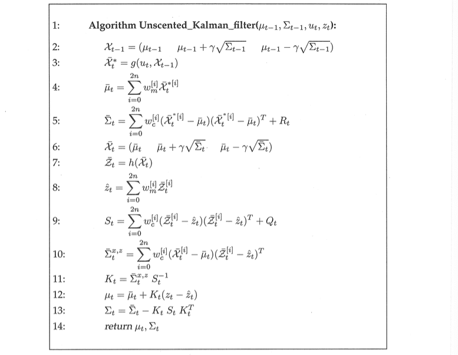

## Infomation Filter

- 正则参数（信息矩阵）

多元高斯分布协方差的逆，$\Omega=\Sigma^{-1}$

- 信息向量

$\xi=\Sigma^{-1}\mu$

引入这两个参数的目的是以为这样表示多元高斯分布会更加简洁

$$
p(\boldsymbol{x})=\eta \exp \left\{-\frac{1}{2} \boldsymbol{x}^{\mathrm{T}} \boldsymbol{\Omega} \boldsymbol{x}+\boldsymbol{x}^{\mathrm{T}} \boldsymbol{\xi}\right\}
$$
再取对数即发现拥有非常漂亮的二次型
$$
-\log p(x)=\text { const }+\frac{1}{2} x^{\mathrm{T}} \boldsymbol{\Omega} x-\boldsymbol{x}^{\mathrm{T}} \boldsymbol{\xi}\\
\frac{\partial[-\log p(x)]}{\partial x}=0 \Leftrightarrow \Omega x-\xi=0 \Leftrightarrow x=\Omega^{-1} \xi
$$

- 算法

$R_t$$,Q_t$分别表示状态转移噪声$\epsilon_t$和测量噪声$\delta_t$的协方差矩阵

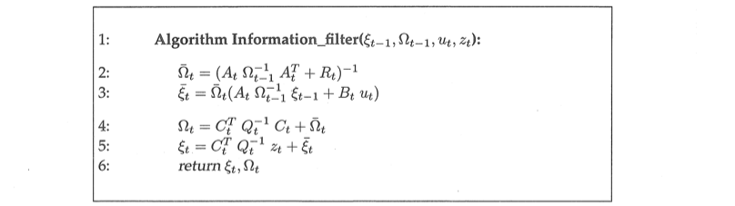

### KF和IF的比较

- IF算法和KF是对偶的，IF拥有优美的更新矩阵，但是预测涉及到求逆运算，所以主要的时间开销在**求逆运算**上，大约是$O(x^{2.4})$，而KF的测量更新K比较麻烦

- IF先将信息整合，再转化为概率，对于高复杂度问题具有更大的优势，对于多机器人问题适应性更强
- EIF的主要缺点在于处理非线性系统，大量的求逆运算让计算非常慢，此时EKF会更有优势

## Nonparametric filters

### Discrete Bayes Filter

把状态空间分解成有限的区域，通过一个**单一的概率值**来表示区域的累积后验

个人的理解是把这些分解的区域全部看成满足**二点分布**$p(x)\sim b(1,p)$来看待，之后累加

- 算法

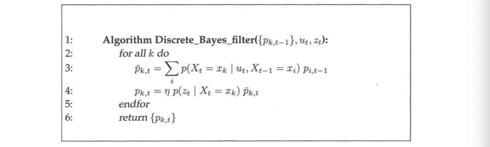

### Histogram Filter

- [Example](https://zhuanlan.zhihu.com/p/96859841)

把整个状态空间切分成互不相交的部分
$$
\operatorname{dom}\left(X_t\right)=x_{1, t} \cup x_{2, t} \cup \cdots x_{k, t}
$$
直方图滤波把每一个区域内的概率近似于相同的，但是如果是非离散的情况，就通过平均的方法来近似
$$
\begin{gathered}
\hat{x}_{k, t}=\left|x_{k, t}\right|^{-1} \int_{x_{k, t}} \boldsymbol{x}_t \mathrm{~d} \boldsymbol{x}_t \\
p\left(z_t \mid x_{k, t}\right) \approx p\left(z_t \mid \hat{x}_{k, t}\right) \\
p\left(x_{k, t} \mid \boldsymbol{u}_t, x_{i, t-1}\right) \approx \eta\left|x_{k, t}\right| p\left(\hat{x}_{k, t} \mid \boldsymbol{u}_t, \hat{x}_{i, t-1}\right)
\end{gathered}
$$

### Binary Bayes Filter

- [Concepts & Explanation](http://ais.informatik.uni-freiburg.de/teaching/ws17/mapping/pdf/slam10-gridmaps.pdf)

用来处理某些不随时间改变的问题，比如说门开/关

这样的话，滤波模型必须要反向进行
$$
\textbf{bel}(x)=\frac{p(\boldsymbol{x})}{p(\neg \boldsymbol{x})}=\frac{p(\boldsymbol{x})}{1-p(\boldsymbol{x})}\\
l(x):=\log \frac{p(x)}{1-p(x)}
$$

- 算法

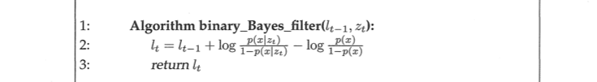

### Particle Filter

- [图示，UC Berkeley](https://homes.cs.washington.edu/~todorov/courses/cseP590/16_ParticleFilter.pdf)
- [更加详细的说明,MIT](https://web.mit.edu/16.412j/www/html/Advanced%20lectures/Slides/Hsaio_plinval_miller_ParticleFiltersPrint.pdf),以下图示主要来源于此

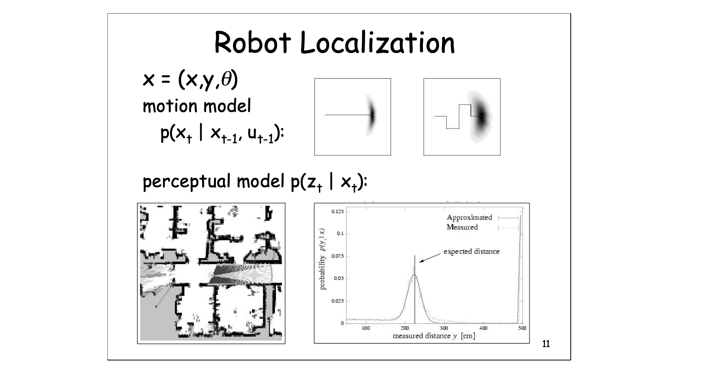

经典卡尔曼滤波的问题：

1.计算开销非常大

2.传感器在最远距离的地方表现并不好

3.给定一个确定的测量方法和确定的距离，图示仍然是一张概率图

4.只对高斯假设下的状态处理表现比较好，对于多假设表现并不好

5.如果在二择的情况下发生了错误，该错误很难被纠正

PF可以解决以上出现的问题

PF主要通过一块区域粒子出现的**密度**来代替pdf

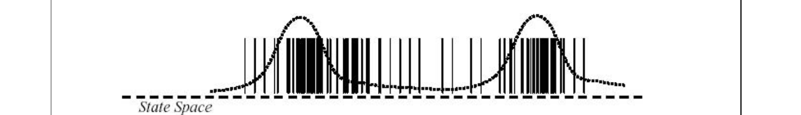

迭代过程：通过计算每个位置的重要值（importance weights）来更新后验分布

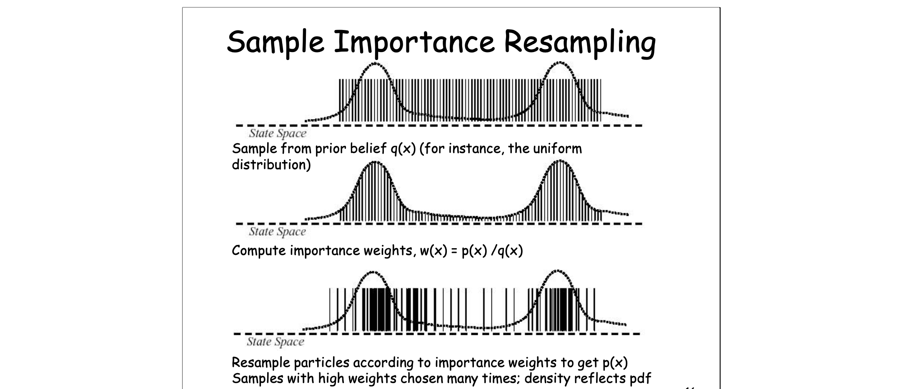

- 算法

一共分为三步，预测，更新，重采样

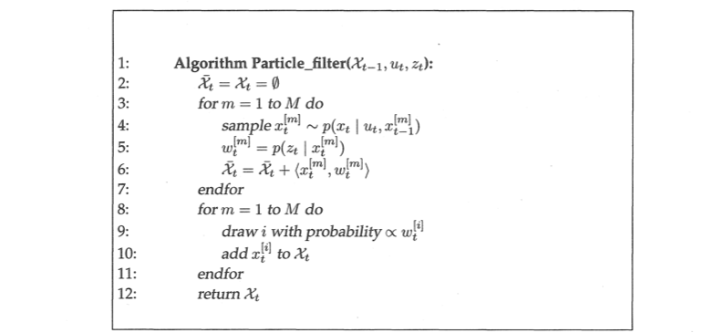

重采样的一步通常可以采用**Monte Carlo**方法，生成和修正过的分布函数相符合的随机样本

生成了k个pdf不同的样本之后，可以把他们放进bucket当中，如果想要选取权重最大的，可以采用**二分查找**

所以整个过程的时间开销为O(nlogn)

也可以通过均匀分布的生成，然后去转动**分布圈**（以下图示）来重采样，不需要再通过查找算法，时间开销为O(n)

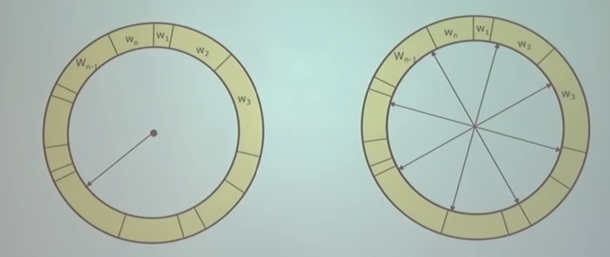

- 重采样的算法

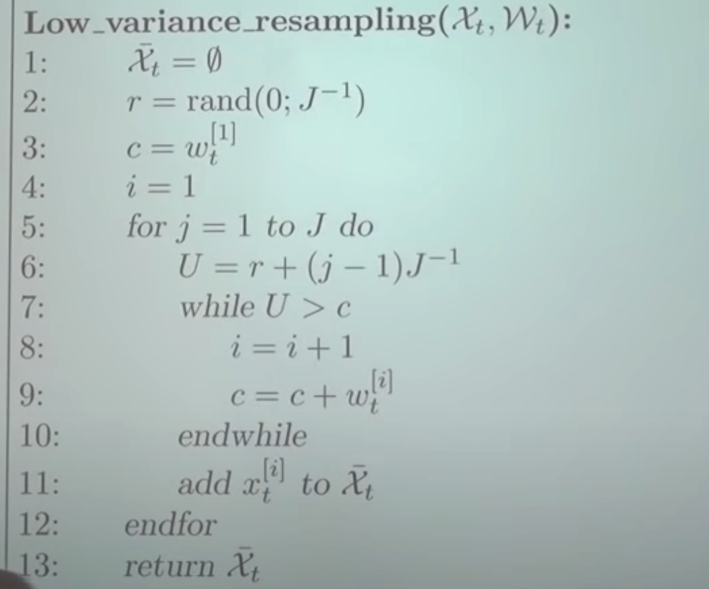

符合**适者生存**的分布，最后分布函数最高的就是所需要的

## SLAM

### Definition

- Given

$u_{1:t},z_{1:t}$

- Wanted

Map $m$

Path of the robot $x_{0:t}$，一般来说基于**隐马尔可夫假设**，只关心$x_{t-1:t}$，也就是**Online SLAM**

### Based on Kalman Filter

Online SLAM: $p(x_t,m | z_{1:t}, u_{1:t})$

基于EKF的SLAM需要知道自己的位置和位姿，以及需要定位的目标的坐标，把他们构成EKF的参数
$$
\underbrace{\left(\begin{array}{c}
x \\
m
\end{array}\right)}_\mu \underbrace{\left(\begin{array}{cc}
\Sigma_{x x} & \Sigma_{x m} \\
\Sigma_{m x} & \Sigma_{m m}
\end{array}\right)}_{\Sigma}
$$

---

理论部分

- State Prediction

通过控制u，只会改变状态空间当中机器人的参数以及对应的协方差矩阵
$$
\underbrace{\left(\begin{array}{c}
\tilde x_R \\
m_1 \\
\vdots \\
m_n
\end{array}\right)}_\mu \underbrace{\left(\begin{array}{cccc}
\tilde\Sigma_{x_R x_R} & \tilde\Sigma_{x_R m_1} & \ldots & \tilde\Sigma_{x_R m_n} \\
\tilde\Sigma_{m_1 x_R} & \Sigma_{m_1 m_1} & \ldots & \Sigma_{m_1 m_n} \\
\vdots & \vdots & \ddots & \vdots \\
\tilde\Sigma_{m_n x_R} & \Sigma_{m_n m_1} & \cdots & \Sigma_{m_n m_n}
\end{array}\right)}_\Sigma
$$
只改变第一行和第一列，时间代价和landmarks数量n呈正相关

- 更新观测

x和每一个landmark都需要重新计算状态空间和协方差

---

实际操作部分

- 初始化

比如可以让机器人位姿的三个参数全是0，所有landmarks的位姿也全是0，这样不确定性就是$\infty$
$$
\begin{aligned}
& \mu_0=\left(\begin{array}{lllll}
0 & 0 & 0 & \ldots & 0
\end{array}\right)^T \\
& \Sigma_0=\left(\begin{array}{cccccc}
0 & 0 & 0 & 0 & \cdots & 0 \\
0 & 0 & 0 & 0 & \cdots & 0 \\
0 & 0 & 0 & 0 & \cdots & 0 \\
0 & 0 & 0 & \infty & \cdots & 0 \\
\vdots & \vdots & \vdots & \vdots & \ddots & \vdots \\
0 & 0 & 0 & 0 & \cdots & \infty
\end{array}\right) \\
&
\end{aligned}
$$

- 预测步骤

可以用机器人运动的计算公式来模拟，在平面内位姿计算如下(用于计算$\mu$)
$$
\left(\begin{array}{l}
x^{\prime} \\
y^{\prime} \\
\theta^{\prime}
\end{array}\right)=\underbrace{\left(\begin{array}{l}
x \\
y \\
\theta
\end{array}\right)+\left(\begin{array}{c}
-\frac{v_t}{\omega_t} \sin \theta+\frac{v_t}{\omega_t} \sin \left(\theta+\omega_t \Delta t\right) \\
\frac{v_t}{\omega_t} \cos \theta-\frac{v_t}{\omega_t} \cos \left(\theta+\omega_t \Delta t\right) \\
\omega_t \Delta t
\end{array}\right)}_{g_{x, y, \theta}\left(u_t,(x, y, \theta)^T\right)}
$$
EKF的第一行g函数可以写成如下形式
$$
\left(\begin{array}{c}
x^{\prime} \\
y^{\prime} \\
\theta^{\prime} \\
\vdots
\end{array}\right)=\left(\begin{array}{c}
x \\
y \\
\theta \\
\vdots
\end{array}\right)+\underbrace{\left(\begin{array}{llll}
1 & 0 & 0 & 0 \ldots 0 \\
0 & 1 & 0 & 0 \ldots 0 \\
0 & 0 & 1 & \underbrace{0 \ldots 0}_{2 N c o l s}
\end{array}\right)^T}_{F_T^T}\left(\begin{array}{c}
-\frac{v_t}{\omega_t} \sin \theta+\frac{v_t}{\omega_t} \sin \left(\theta+\omega_t \Delta t\right) \\
\frac{v_t}{\omega_t} \cos \theta-\frac{v_t}{\omega_t} \cos \left(\theta+\omega_t \Delta t\right) \\
\omega_t \Delta t
\end{array}\right)
$$
第二行，更新$\Sigma$
$$
G_t=\left(\begin{array}{cc}
G_t^x(=J_{motion}) & 0 \\
0 & I
\end{array}\right)\\
\begin{aligned}
G_t^x & =\frac{\partial}{\partial(x, y, \theta)^T}\left[\left(\begin{array}{c}
x \\
y \\
\theta
\end{array}\right)+\left(\begin{array}{c}
-\frac{v_t}{\omega_t} \sin \theta+\frac{v_t}{\omega_t} \sin \left(\theta+\omega_t \Delta t\right) \\
\frac{v_t}{\omega_t} \cos \theta-\frac{v_t}{\omega_t} \cos \left(\theta+\omega_t \Delta t\right) \\
\omega_t \Delta t
\end{array}\right)\right] \\
& =I+\frac{\partial}{\partial(x, y, \theta)^T}\left(\begin{array}{c}
-\frac{v_t}{\omega_t} \sin \theta+\frac{v_t}{\omega_t} \sin \left(\theta+\omega_t \Delta t\right) \\
\frac{v_t}{\omega_t} \cos \theta-\frac{v_t}{\omega_t} \cos \left(\theta+\omega_t \Delta t\right) \\
\omega_t \Delta t
\end{array}\right) \\
& =I+\left(\begin{array}{ccc}
0 & 0 & -\frac{v_t}{\omega_t} \cos \theta+\frac{v_t}{\omega_t} \cos \left(\theta+\omega_t \Delta t\right) \\
0 & 0 & -\frac{v_t}{\omega_t} \sin \theta+\frac{v_t}{\omega_t} \sin \left(\theta+\omega_t \Delta t\right) \\
0 & 0 & 0
\end{array}\right) \\
& =\left(\begin{array}{ccc}
1 & 0 & -\frac{v_t}{\omega_t} \cos \theta+\frac{v_t}{\omega_t} \cos \left(\theta+\omega_t \Delta t\right) \\
0 & 1 & -\frac{v_t}{\omega_t} \sin \theta+\frac{v_t}{\omega_t} \sin \left(\theta+\omega_t \Delta t\right) \\
0 & 0 & 1
\end{array}\right)
\end{aligned}
$$
综上可以得到EKF SLAM的预测步骤算法

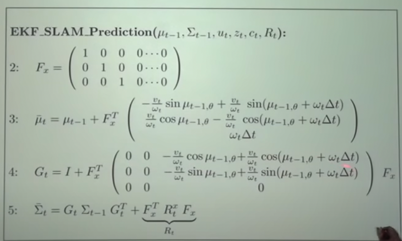

- 更新测量

对于观测值z来说，

如果观测到了就用新的观测值$z_t^i=\left(r_t^i, \phi_t^i\right)^T$

如果观测失败则用预测值来代替，类似于概率论当中的假设检验
$$
\begin{aligned}
& \left(\begin{array}{c}
\bar{\mu}_{j, x} \\
\bar{\mu}_{j, y}
\end{array}\right)=\left(\begin{array}{l}
\bar{\mu}_{t, x} \\
\bar{\mu}_{t, y}
\end{array}\right)+\left(\begin{array}{c}
r_t^i \cos \left(\phi_t^i+\bar{\mu}_{t, \theta}\right) \\
r_t^i \sin \left(\phi_t^i+\bar{\mu}_{t, \theta}\right)
\end{array}\right) \\
& \text { observed \ \ \ \ \ \ \ \ estimated \ \ \ \ \ \ \ relative } \\
& \text { location of \ \ \ \ \ robot's \ \ \ \ \ \ \ \ \ \ measurement } \\
& \text { landmark } \mathrm{j} \quad \text { location } \\
&
\begin{aligned}
\delta & =\left(\begin{array}{c}
\delta_x \\
\delta_y
\end{array}\right)=\left(\begin{array}{c}
\bar{\mu}_{j, x}-\bar{\mu}_{t, x} \\
\bar{\mu}_{j, y}-\bar{\mu}_{t, y}
\end{array}\right) \\
q & =\delta^T \delta \\
\hat{z}_t^i & =\left(\begin{array}{c}
\sqrt{q} \\
\operatorname{atan} 2\left(\delta_y, \delta_x\right)-\bar{\mu}_{t, \theta}
\end{array}\right) \\
& =h\left(\bar{\mu}_t\right)
\end{aligned}
\end{aligned}
$$
通过估计或者更新可以得到观测值的$\mathbf{J_{observation}}$
$$
\begin{aligned}
{ }^{\text {low }} H_t^i & =\frac{\partial h\left(\bar{\mu}_t\right)}{\partial \bar{\mu}_t} \\
& =\left(\begin{array}{ccc}
\frac{\partial \sqrt{q}}{\partial x} & \frac{\partial \sqrt{q}}{\partial y} & \cdots \\
\frac{\partial \operatorname{atan} 2(\ldots)}{\partial x} & \frac{\partial \operatorname{atan} 2(\ldots)}{\partial y} & \cdots
\end{array}\right)
\end{aligned}
$$
再通过一些变化即可得到整个更新测量的算法

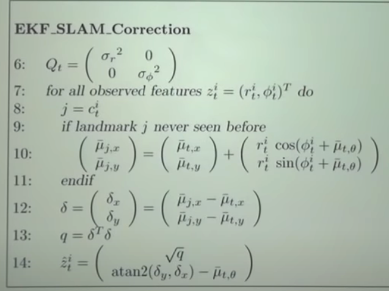

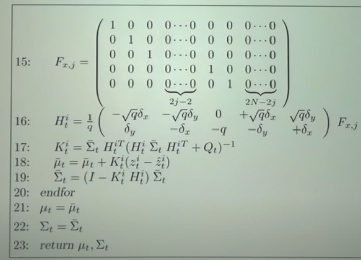

---

Properties of EKF SLAM

- Loop Closing

可能会重复识别一个已经建图的区域

收集数据的时候有比较高的不确定性，通过这种方式会让单个landmark的不确定性降低，可以被很好的利用

但是错误的Loop Closing会导致滤波离散？散度暴增？(Filter Divergence)，甚至可能会让整个系统崩溃

- Fully correlated

整个系统，机器人和landmarks都是有相关性的

当然，如果两个landmarks是不相关的，在这个模型当中也会被认为是相关的，filter出来的uncertainty会比实际上的小很多（对于filter的估计过优化）

所有**子协方差矩阵**的行列式值单调递减

所有新的landmarks在初始化的时候uncertainty为最大值

### FastSLAM

>基于粒子滤波，适合处理低维度的状态空间，而非高纬度的状态空间

- 初始状态空间

$$
x=\left(x_{1: t}, m_{1, x}, m_{1, y}, \ldots, m_{M, x}, m_{M, y}\right)^T
$$

如果知道了机器人的位姿，去建图是比较简单的，原因是由于**条件概率公式**
$$
p(a,b)=p(b|a)p(a)
$$
如果把b设置为landmarks，a设置为机器人的位姿，想要建图（计算状态空间（a，b））只需要知道**位姿向量**和对应的landmarks即可，这样就可以建立状态空间中机器人的位置和图的关系

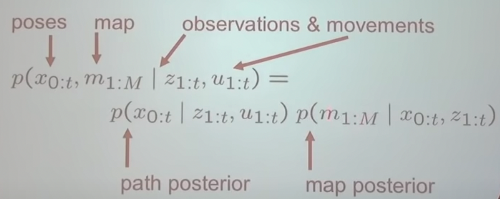

而其中map的一项是**条件独立**的，所以可以写成多个landmarks连乘的形式，等式右边的每一项都是2维的，可以用EKF计算得到
$$
p(m_{1:M}|x_{0:t},z_{1:t})=\prod_1^{M} p(m_{i}|x_{0:t},z_{1:t})
$$

- 机器人路径的建模

每一个机器人的位姿都是一个路径上的假设，**不基于过去的状态**，所以不需要记录过去的位姿

这样每一个**粒子**可以用以下的形式表示，每一个landmark都是二位的EKF
$$
X_i=\mathbf{vec}<x,y,\theta,\mathsf{landmark_1},...,\mathsf{landmark_M}>
$$

- 状态更新

根据更新状态后的观测，和预测值的**符合程度**来给予权重，最后通过权重来更新particle

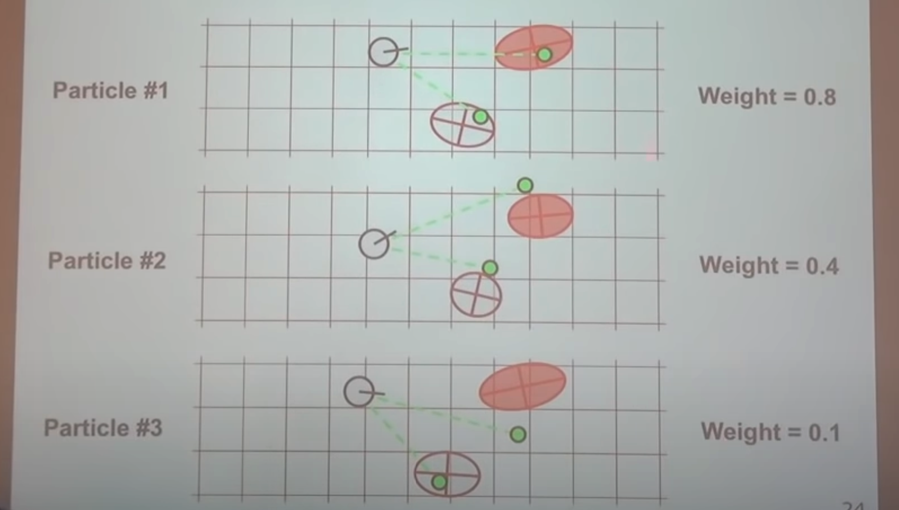

- 关键步骤

通过之前的状态来生成新的位姿
$$
x_t^{[k]} \sim p\left(x_t \mid x_{t-1}^{[k]}, u_t\right)
$$
计算每个粒子的权重,Q是观测协方差矩阵,$\hat z$是预测的观测值
$$
w^{[k]}=|2 \pi Q|^{-\frac{1}{2}} \exp \left\{-\frac{1}{2}\left(z_t-\hat{z}^{[k]}\right)^T Q^{-1}\left(z_t-\hat{z}^{[k]}\right)\right\}
$$
通过EKF来更新每一个观测的landmarks，之后重采样

- 算法

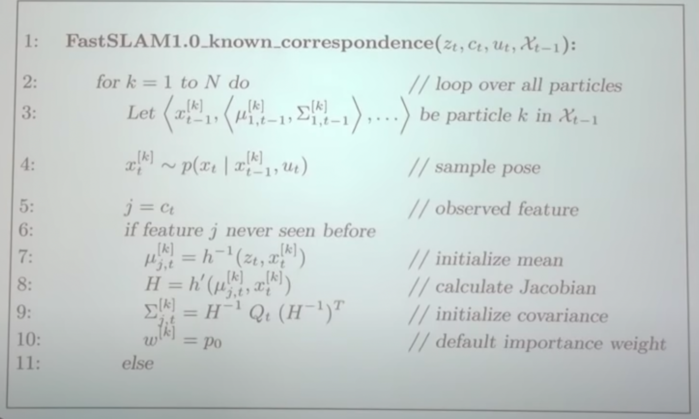

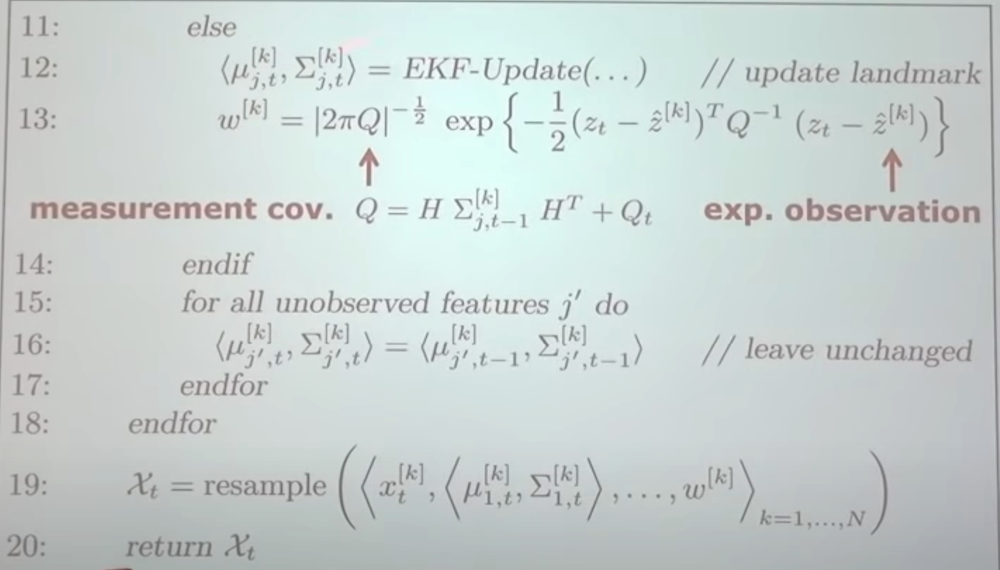

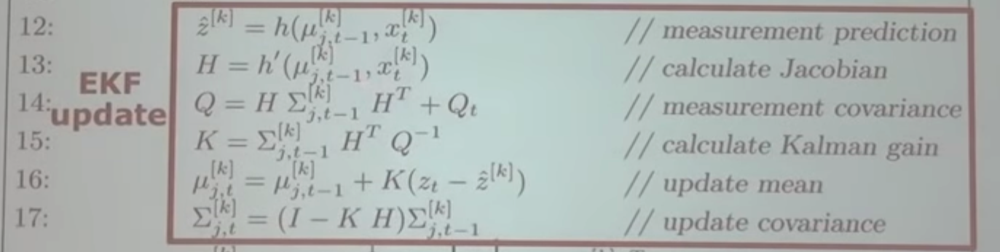

权重计算，最后同样符合高斯分布，符合离中心越近，置信度越高的直觉
$$
\begin{aligned}
& w^{[k]}=\frac{\operatorname{target}\left(x^{[k]}\right)}{\operatorname{proposal}\left(x^{[k]}\right)} \\
& =\frac{p\left(x_{1: t}^{[k]} \mid z_{1: t}, u_{1: t}\right)}{p\left(x_t^{[k]} \mid x_{t-1}, u_t\right) p\left(x_{1: t-1}^{[k]} \mid z_{1: t-1}, u_{1: t-1}\right)} \\
& =\frac{\eta p\left(z_t \mid x_{1: t}^{[k]}, z_{1: t-1}\right) p\left(x_t+x_{t-1}^{[k]}, u_t\right)}{p\left(x_t^{[k]} \mid x_{t-1}^{[k]}, u_t\right)} \\
& \frac{p\left(x_{1: t-1}^{[k]}+z_{1: t-1}, u_{1: t-1}\right)}{p\left(x_{1: t-1}^{[k]}+z_{1: t-1}, u_{1: t-1}\right)} \\
& =\eta p\left(z_t \mid x_{1: t}^{[k]}, z_{1: t-1}\right) \\

& =\eta p\left(z_t \mid x_{1: t}^{[k]}, z_{1: t-1}\right) \\
& =\eta \int p\left(z_t \mid x_{1: t}^{[k]}, z_{1: t-1}, m_j\right) p\left(m_j \mid x_{1: t}^{[k]}, z_{1: t-1}\right) d m_j \\
& =\eta \int \underbrace{p\left(m_j \mid x_{1: t-1}^{[k]}, z_{1: t-1}\right)}_{\mathcal{N}\left(m_j ; \mu_{j, t-1}^{[k]}, \Sigma_{i, t-1}^{[k]}\right)} \underbrace{p\left(z_t \mid x_t^{[k]}, m_j\right)}_{\mathcal{N}\left(z_t ; \hat{z}^{[k]}, Q_t\right)} d m_j

\end{aligned}
$$

---

- 如何知道观测对应的哪一个landmark？

如果两个landmark的估计有重合的部分，则取概率比较大的那一个

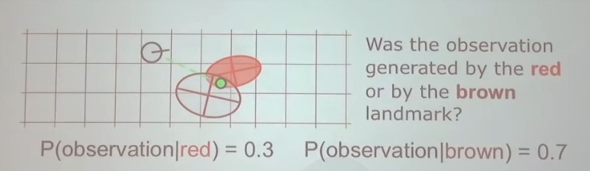

如果这个概率的值太低，则生成一个新的landmark

生成的sample需要足够大，不然很容易出现错误

---

- 时间复杂度

n为粒子数，m为地图的采样点数

更新机器人的状态$O(n)$

把观测值算进权重当中$O(n)$

重采样$O(mn)$

优化的**决策树模型**,重采样的时间复杂度可以减小到$O(n\mathsf{log}m)$,对应的观测需要增加到$O(n\mathsf{log}m)$

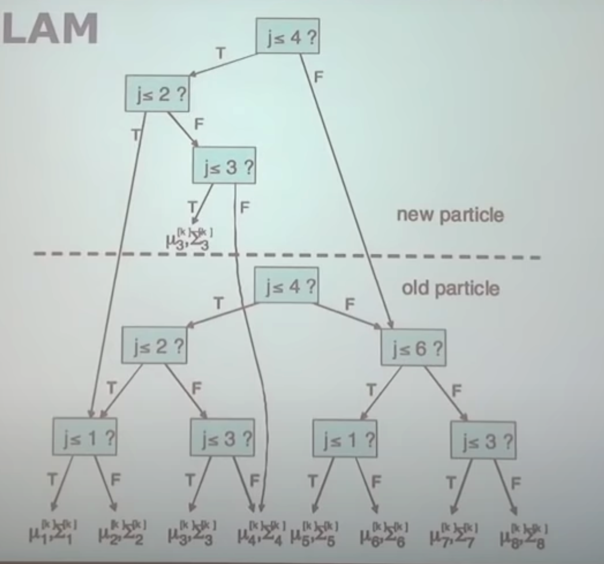
